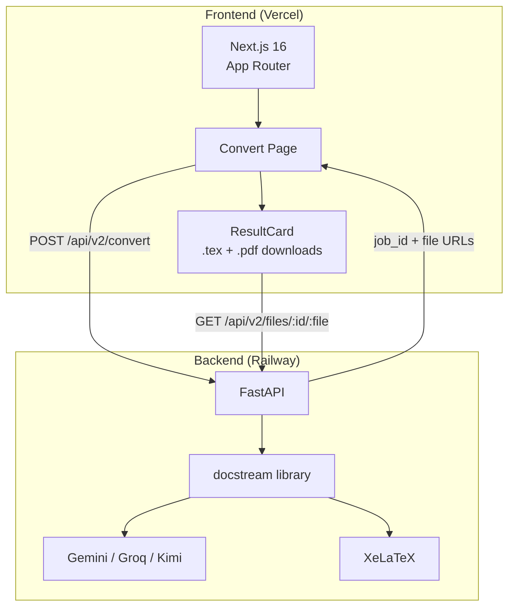

# Docstream Web

> Web interface for AI-powered PDF to LaTeX conversion

[](https://docstream-web.vercel.app)
[](https://nextjs.org/)
[](https://fastapi.tiangolo.com/)
[](LICENSE)

**Docstream Web** is the full-stack web application built on top of the [docstream](https://github.com/YashKasare21/docstream) Python library. Upload a PDF, choose a template, and download publication-quality LaTeX + PDF — no local setup required.

**Stack:** Next.js 16 (App Router) · FastAPI · docstream library · XeLaTeX · Gemini AI

---

## 🌐 Live Demo

**[https://docstream-web.vercel.app](https://docstream-web.vercel.app)**

---

## ✨ Features

- **Drag-and-drop PDF upload** — supports PDFs up to 20MB
- **Template selection** — Academic Report or IEEE Conference Paper
- **Real-time conversion progress** — live stage indicators
- **Inline result preview** — view output directly in the browser
- **One-click downloads** — get both `.tex` source and compiled `.pdf`
- **Feedback system** — emoji reactions on conversion results
- **Conversion statistics** — track usage and quality scores

---

## 🏗️ Architecture


```
┌─────────────────────────── Frontend (Vercel) ────────────────────────────┐
│                                                                          │
│   Next.js 16 (App Router)                                                │
│        │                                                                 │
│        ▼                                                                 │
│   Convert Page ◄──── job_id + file URLs ────────────────────────────┐   │
│        │                                                             │   │
│        ▼                                                             │   │
│   ResultCard (.tex + .pdf downloads)                                 │   │
│        │                                                             │   │
└────────┼─────────────────────────────────────────────────────────────┼───┘
         │  POST /api/v2/convert            GET /api/v2/files/:id/:file│
         ▼                                                             │
┌─────────────────────────── Backend (Railway) ────────────────────────┼───┐
│                                                                      │   │
│   FastAPI ──▶ docstream library ──▶ Gemini / Groq / Kimi             │   │
│                                └──▶ XeLaTeX ─────────────────────────┘   │
│                                                                          │
└──────────────────────────────────────────────────────────────────────────┘
```

<details>
<summary>View Mermaid source</summary>



</details>

---

## 🚀 Running Locally

### Prerequisites

- Node.js 18+
- Python 3.10+
- XeLaTeX: `sudo apt install texlive-xetex texlive-latex-extra`
- API keys (Gemini minimum, others optional)

### Frontend

```bash
cd docstream-web
npm install
cp .env.example .env.local
# Set NEXT_PUBLIC_API_URL=http://localhost:8000
npm run dev
```

Open [http://localhost:3000](http://localhost:3000).

### Backend

```bash
cd docstream-web/docstream-api
python -m venv .venv
source .venv/bin/activate
pip install -r requirements.txt
cp .env.example .env
# Add your API keys to .env
uvicorn main:app --reload --port 8000
```

API docs at [http://localhost:8000/docs](http://localhost:8000/docs).

---

## 🌍 Deployment

### Backend → Railway

Configured via `railway.toml` and `nixpacks.toml`:
- Builder: Nixpacks with `texlive.combined.scheme-medium`
- `IEEEtran.cls` downloaded from CTAN at build time
- Health check: `GET /api/health`

```bash
cd docstream-api
railway link          # select your Railway project
railway variables set GEMINI_API_KEY="..."
railway variables set GROQ_API_KEY="..."
railway variables set ALLOWED_ORIGINS="https://docstream-web.vercel.app"
railway up --detach
```

### Frontend → Vercel

```bash
vercel --prod
vercel env add NEXT_PUBLIC_API_URL production
# Enter your Railway backend URL: https://xxx.up.railway.app
vercel --prod
```

---

## 📁 Project Structure

```
docstream-web/
├── src/
│   ├── app/
│   │   ├── page.tsx              # Landing page
│   │   ├── convert/page.tsx      # Conversion flow & state
│   │   └── stats/page.tsx        # Feedback statistics
│   ├── components/
│   │   ├── landing/              # Hero, features, how-it-works sections
│   │   ├── convert/              # DropZone, ResultCard, FormatSelector
│   │   └── feedback/             # FeedbackWidget (emoji reactions)
│   └── lib/
│       └── api.ts                # Typed API client
├── docstream-api/
│   ├── main.py                   # FastAPI app + CORS + lifespan
│   ├── routes/
│   │   ├── convert.py            # POST /api/v2/convert
│   │   ├── health.py             # GET /api/health, /api/v2/providers
│   │   └── feedback.py           # POST /api/v2/feedback
│   ├── services/
│   │   └── converter.py          # docstream library wrapper
│   ├── docstream_local/          # Bundled v2 library (local copy)
│   ├── railway.toml              # Railway deployment config
│   └── nixpacks.toml             # Nix packages (texlive + IEEEtran)
├── vercel.json                   # Vercel deployment config
└── README.md
```

---

## 🔌 API Reference

### `POST /api/v2/convert`

Convert a document to LaTeX and PDF.

**Request:** `multipart/form-data`

| Field | Type | Description |
|-------|------|-------------|
| `file` | File | PDF file (max 20MB) |
| `template` | string | `"report"` or `"ieee"` |

**Response:**
```json
{
  "success": true,
  "job_id": "abc123",
  "tex_url": "/api/v2/files/abc123/document.tex",
  "pdf_url": "/api/v2/files/abc123/document.pdf",
  "processing_time": 12.4,
  "document_type": "research_paper",
  "template_used": "ieee",
  "quality_score": 0.87
}
```

### `GET /api/v2/files/{job_id}/{filename}`

Download a generated `.tex` or `.pdf` file by job ID.

### `GET /api/v2/providers`

List available AI providers and their status.

### `GET /api/health`

Health check. Returns `{ "status": "ok", "version": "0.1.0" }`.

---

## 📄 License

MIT License — see [LICENSE](LICENSE) for details.

---

## 👤 Author

**Yash Kasare**
- GitHub: [@YashKasare21](https://github.com/YashKasare21)
- Email: yashnkasare16@gmail.com
- Library: [github.com/YashKasare21/docstream](https://github.com/YashKasare21/docstream)
- Live Demo: [docstream-web.vercel.app](https://docstream-web.vercel.app)
